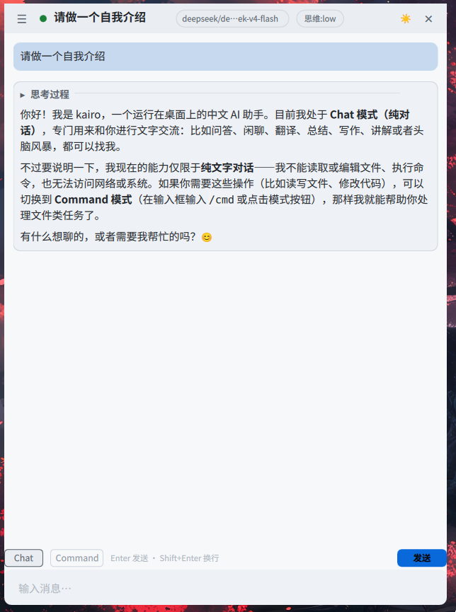
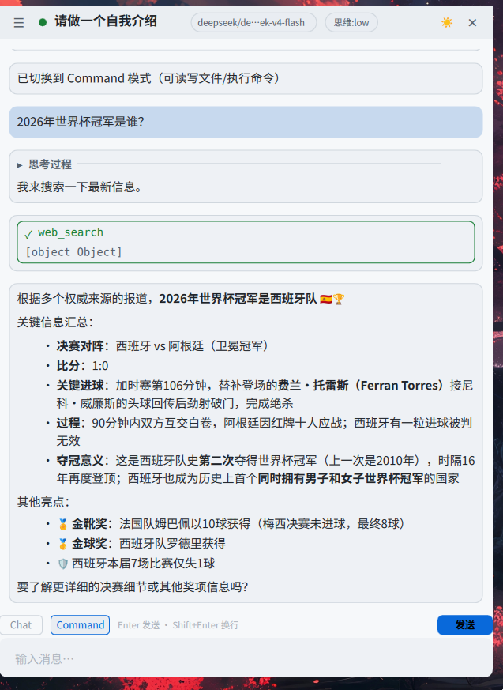
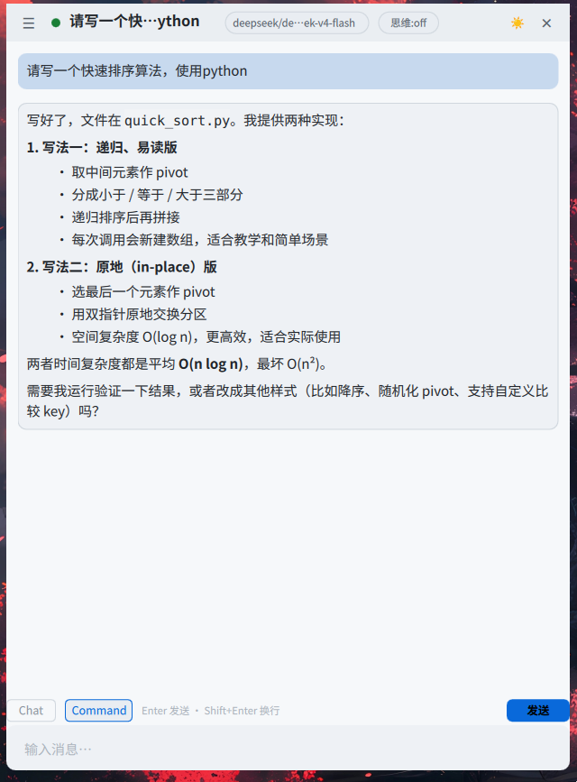
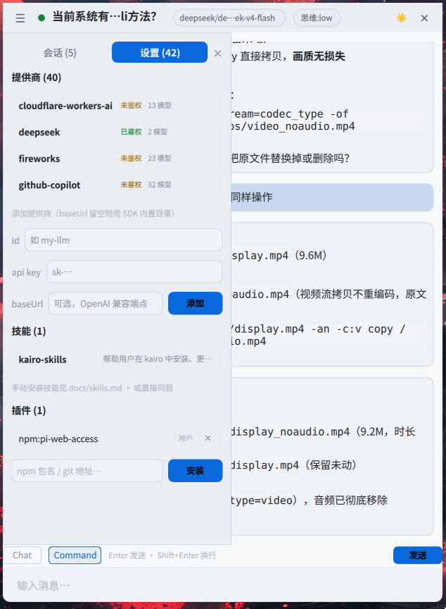

# kairo

Hyprland 上的即用型桌面 AI 助手：**quickshell 浮窗（QML）** + **PI SDK（Node daemon）**。

`Super+A` 随叫随用，Chat / Command 双模式：纯对话不碰工具，完整 agentic 时写操作先弹 diff 确认、跑命令先确认。

**语言**：中文 | [English](README.en.md)

## 功能特性

- **双模式**：Chat 纯对话（无工具调用）；Command 完整 agentic（read/write/edit/bash/grep/find/ls 共 7 个内置工具）。
- **安全确认门**：写操作先生成 diff、跑命令先确认全文才放行；只读工具自动批准。
- **配置隔离**：独立 PI 配置目录 `~/.config/kairo/agent`（mcp / skills / plugins / 会话均与 `~/.pi` 无关）。
- **会话管理**：单活跃会话 + 历史会话列表，支持新建 / 切换 / 删除。
- **流式 Markdown 渲染**：气泡化回复、工具卡、审批对话框，中文输入开箱即用。
- **systemd 托管**：daemon 常驻并自动恢复最近会话，面板由 Hyprland keybind 唤起。

## 截图

| Chat 模式：纯对话 | Command 模式：工具调用（web_search） |
|---|---|
|  |  |

| Command 模式：代码写入 | 设置面板：Provider 与技能 |
|---|---|
|  |  |

## 前置依赖

| 依赖 | 要求 | 说明 |
|------|------|------|
| Hyprland | 运行环境 | 浮窗为 layer-shell 窗口 |
| Node.js | ≥ 24 | daemon 构建与运行（`install.sh` 会自动检查版本） |
| pi（PI Coding Agent） | 已安装并完成 provider 登录 | 密钥从 `~/.pi/agent` 导入；暂无密钥也能装完，稍后 `kairoctl reimport` |
| quickshell | ≥ 0.3 | 浮窗渲染。`nix profile install nixpkgs#quickshell` 或发行版包 / AUR |
| python3 | 任意 | `kairoctl status` 解析 JSON |
| fcitx5 | 可选 | 面板中文输入；nix 环境由 toggle-kairo.sh 自动处理 |

仓库位置不限——安装脚本会自动把实际路径写入 systemd 单元与 Hyprland 片段。

## 快速开始

```bash
# 1. 安装（构建 daemon → systemd 单元 → 导入密钥 → 写入 Hyprland 片段）
./scripts/install.sh            # 尚未配置 pi 密钥时加 --skip-setup，稍后 kairoctl reimport

# 2. 唤起浮窗（Super+A，或手动）
./scripts/toggle-kairo.sh

# 3. 管理
kairoctl status      # 模式/会话/待审批
kairoctl restart     # 重启 daemon（自动恢复最近会话）
kairoctl logs        # 实时日志
```

## 架构

```
Hyprland
├─ keybind Super+A ──→ scripts/toggle-kairo.sh ──→ quickshell (shell/config.qml)
│                                                     └─ IPC: quickshell ipc call kairo toggle
├─ quickshell 面板（QML，右上角 overlay 层）
└─ kairo-daemon（systemd --user，Node 24）
     ├─ HTTP :44811  REST 控制面（Bearer token 鉴权）
     ├─ WebSocket /ws 事件流（脚本/其他客户端用）
     └─ panel.sock    Unix socket（面板专用，0600 文件权限鉴权）
```

## 目录

| 路径 | 说明 |
|------|------|
| `daemon/` | Node + TS 守护进程（`npm run build` → `dist/main.js`） |
| `daemon/src/approval.ts` | 确认门：edit/write 生成 diff、bash 命令全文，approval 注册表统一持有审批 Promise |
| `daemon/src/agent.ts` | AgentSession 封装、事件归一化、`setRebindSession` 会话重绑 |
| `daemon/src/panel-socket.ts` | 面板 Unix socket（quickshell 无 TCP 支持的原生替代通道） |
| `shell/` | quickshell QML 项目（`config.qml` 入口） |
| `shell/qml/` | 组件：ChatPanel / MessageBubble / ToolCard / ApprovalDialog / SessionSidebar / InputBar / KairoClient / TitleBar |
| `scripts/` | setup.sh（密钥导入）/ install.sh / toggle-kairo.sh / kairoctl |
| `skills/` | 内置技能（kairo-skills：教模型自行安装技能，随安装同步） |
| `docs/` | 配置参考与使用说明（含 `docs/skills.md` 技能手动安装指南） |

## 与宿主隔离

kairo 使用独立 PI 配置目录 `~/.config/kairo/agent`（mcp/skills/plugins/会话均与 `~/.pi` 无关），
密钥由 `scripts/setup.sh` 一次性导入后独立演进；Command 模式工作目录为中性目录
`~/.local/share/kairo/workdir`（不放置任何 AGENTS.md/.pi），避免加载宿主项目资源。

## 里程碑状态

M0 技术验证 ✅ · M1 daemon 骨架 ✅ · M2 浮窗+聊天 ✅ · M3 Command 模式 ✅ · M4 会话与打磨 ✅

完整方案与决策记录见 [PLAN.md](PLAN.md)。

## 演示

Command 模式下的真实工作流：向 AI 提出视频处理需求，它给出多种方案（ffmpeg 转码 / mpv·vlc 播放），
命令执行前弹出确认卡，批准后生成无音轨视频 `video_noaudio.mp4`。

[视频演示](assets/display.mp4) 

## 贡献

欢迎提交 Issue 与 PR。

- `daemon/` 为 npm workspace：改动后 `npm run build`，再 `kairoctl restart` 生效。
- `shell/` 为 quickshell QML：改动后刷新浮窗即可。
- 完整的实现方案与决策记录见 [PLAN.md](PLAN.md)。

## 许可证

 [LICENSE](LICENSE)
